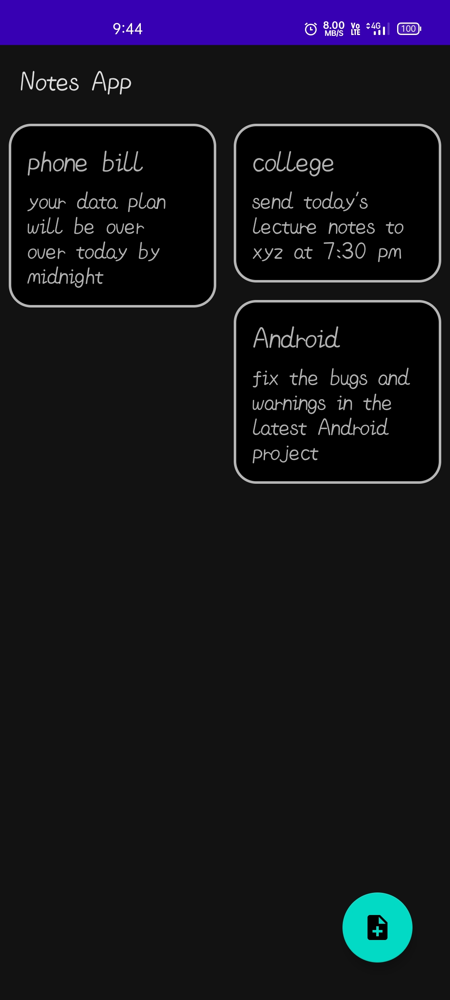
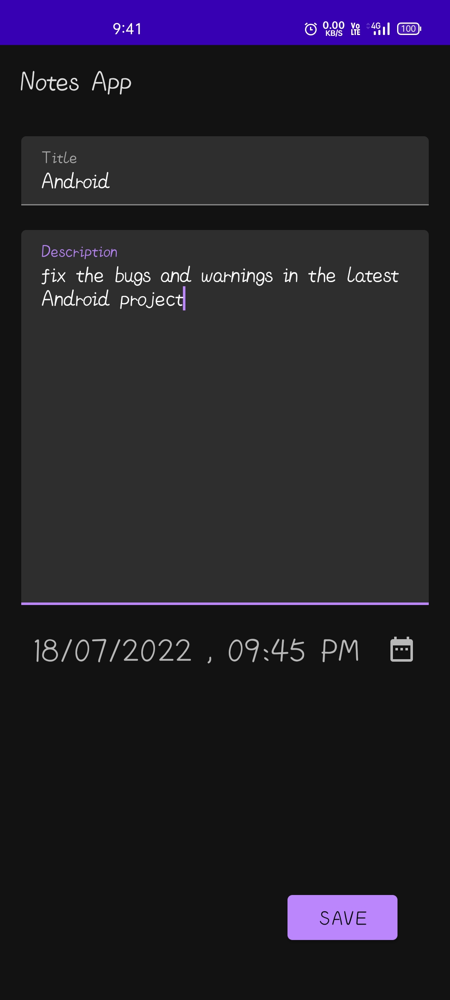
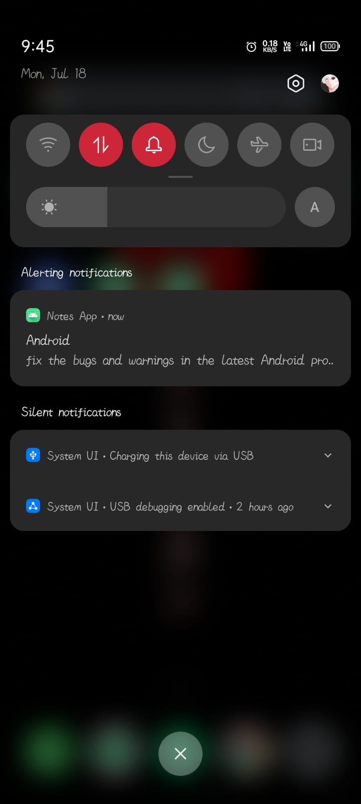
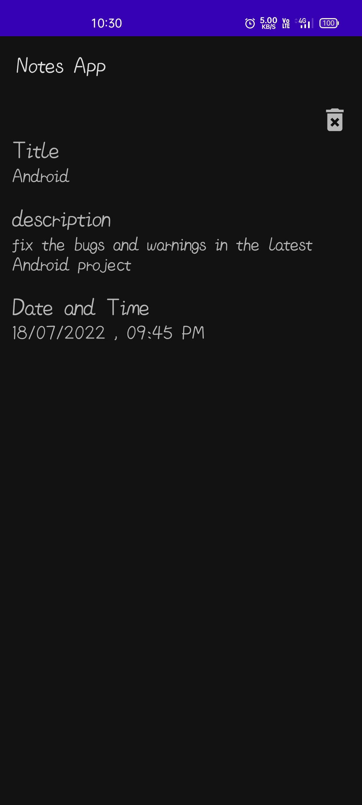
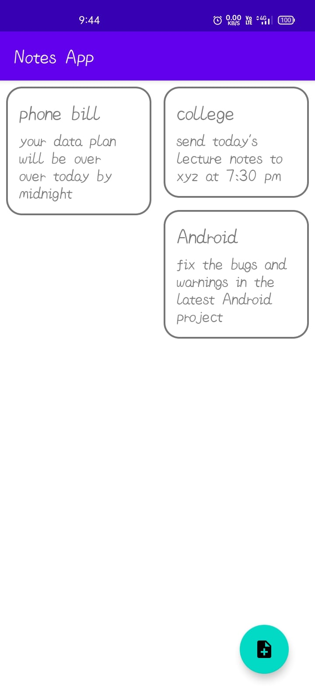
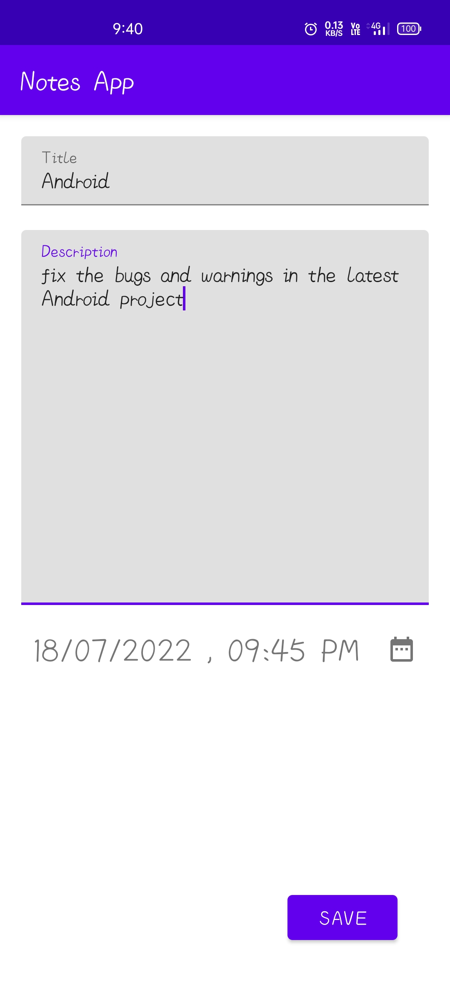
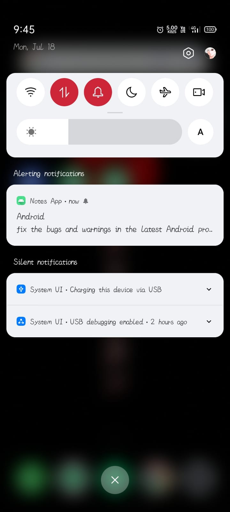
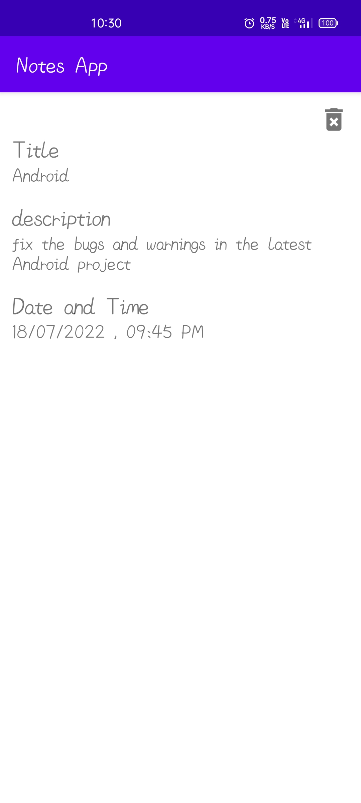

# Notes-App

Notes App is an android application which help you to manage your schedules and notes.
The app will also push a notification on your smartphone whenever the note hit the clock.

## Features

- Support light/dark mode
- Easy to create notes and reminders
- Push notifications

## Screenshots
### Dark Mode
|  |  |  | 
|:---:|:---:|:---:|:---:|
|Home Screen| Note Editor | Notification| Description

### Light Mode
|  |  |  | 
|:---:|:---:|:---:|:---:|
|Home Screen| Note Editor | Notification| Description
